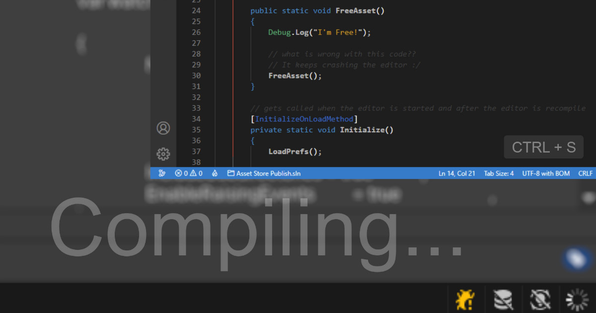
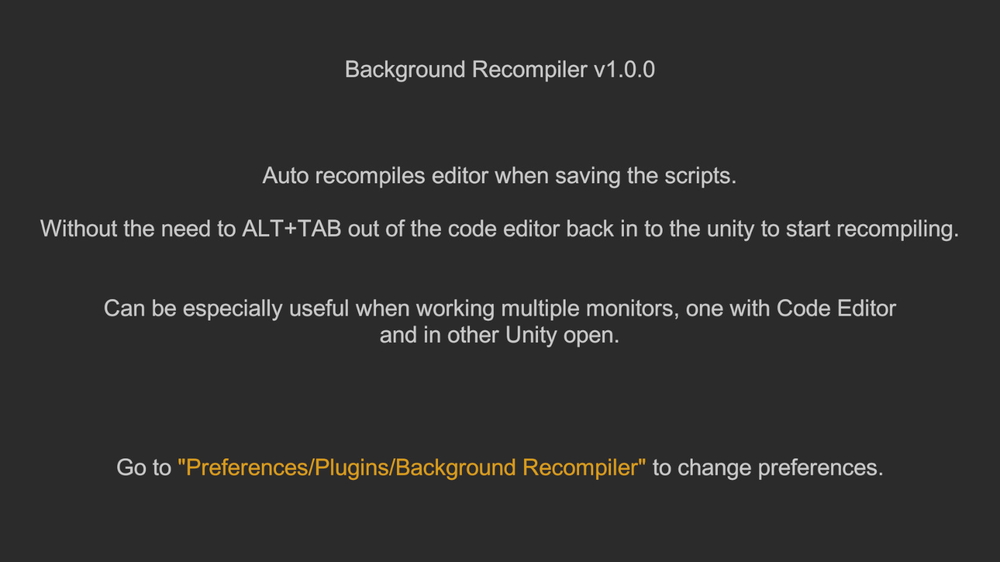
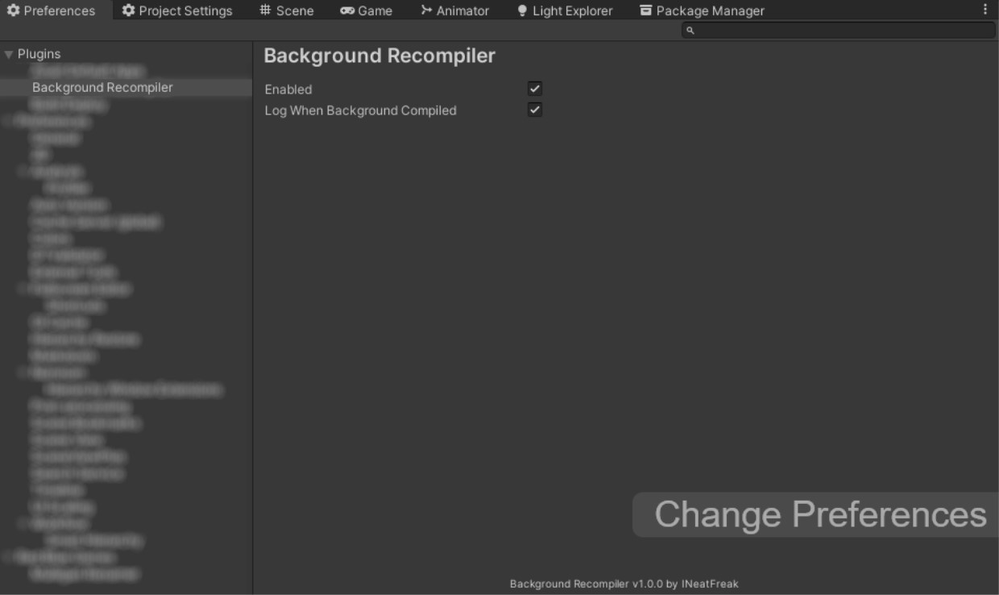

# Unity Background Recompiler

Auto recompiles the editor when saving the scripts. Without the need to ALT+TAB out of the code editor back into the unity to start recompiling.

Can be especially useful when working with multiple monitors, one with Code Editor and in other Unity open.

# Screenshots

